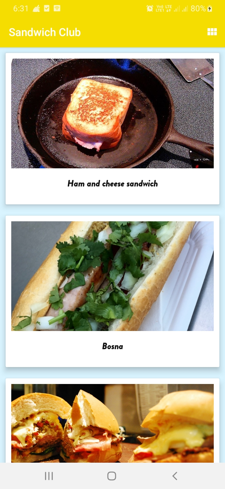
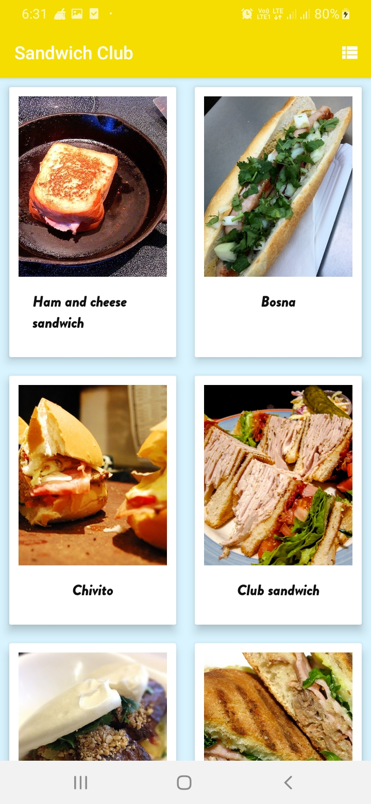
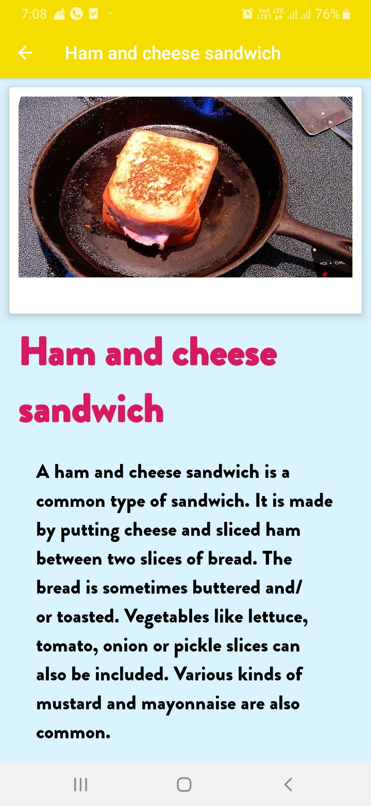

# Sandwich_Club

# Project Overview

In this project, you will complete the Sandwich Club app to show the details of each sandwich once it is selected.

# Why this Project

Building a layout and populating its fields from data received as JSON is a common task for Android Developers. Although JSON parsing is usually done using libraries, writing the JSON parsing for this project will help you to better understand how it is processed.

# What Will I Learn?

Through this project, you will:
1. 	Learn how to submit projects for review
2. 	Practice JSON parsing to a model object
3. 	Design an activity layout
4. 	Populate all fields in the layout accordingly

# MIT License

Copyright (c) 2020 Aman817

Permission is hereby granted, free of charge, to any person obtaining a copy
of this software and associated documentation files (the "Software"), to deal
in the Software without restriction, including without limitation the rights
to use, copy, modify, merge, publish, distribute, sublicense, and/or sell
copies of the Software, and to permit persons to whom the Software is
furnished to do so, subject to the following conditions:

The above copyright notice and this permission notice shall be included in all
copies or substantial portions of the Software.

THE SOFTWARE IS PROVIDED "AS IS", WITHOUT WARRANTY OF ANY KIND, EXPRESS OR
IMPLIED, INCLUDING BUT NOT LIMITED TO THE WARRANTIES OF MERCHANTABILITY,
FITNESS FOR A PARTICULAR PURPOSE AND NONINFRINGEMENT. IN NO EVENT SHALL THE
AUTHORS OR COPYRIGHT HOLDERS BE LIABLE FOR ANY CLAIM, DAMAGES OR OTHER
LIABILITY, WHETHER IN AN ACTION OF CONTRACT, TORT OR OTHERWISE, ARISING FROM,
OUT OF OR IN CONNECTION WITH THE SOFTWARE OR THE USE OR OTHER DEALINGS IN THE
SOFTWARE.

# Screenshots

# Main

# Home

# Home

# Didplay

